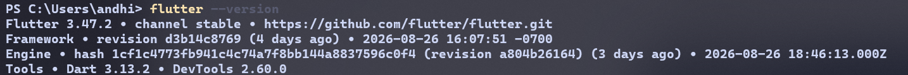

## Jobsheet: Matkul Mobile Development Week 1

| **Informasi** | **Detail** |
| --- | --- |
| Mata Kuliah | Mobile Development |
| Nama | Andhika Daffa Athaaillah |
| Absen | 02 |
| NIM | 244107020223 |

---
# Practicum
Preparing for the environment

![[Pasted image 20260830195602.png]
![[Pasted image 20260830192853.png|700]]

## First Fluterr App
Create and running the project
![[Pasted image 20260830200441.png]]

![[Pasted image 20260830200943.png]]

lib main code
![[Pasted image 20260830201902.png]]

Mobile UI
![[WhatsApp Image 2026-08-30 at 20.16.00.jpeg|218]]

Push the my_first_app folder to github
![[Pasted image 20260830203641.png]]
![[Pasted image 20260830205756.png]]

## Mini assignment
Adding nim
![[Pasted image 20260830205840.png]]
![[Pasted image 20260830210111.png|266]]

---
# Reflection
- When is a native approach a better choice than a cross-platform one?
Maximum performance (games, AR/VR, heavy animations), Access to latest platform features immediately, and Large, complex apps with deep OS integration

- How does state changes relate to the widget tree and declarative UI?
In declarative UI (Flutter), the UI is a function of state. When state changes, Flutter rebuilds only the affected widgets in the tree. 

- Why are small commits with clear messages beneficial for team work and your portfolio?
 Reviewers can understand changes quickly and others know what changed and why.

---

